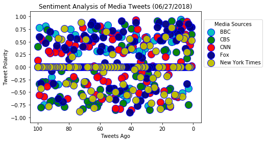
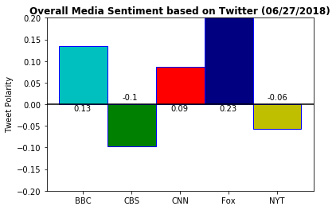

## Analysis 

-NYT and CBS had the most negative Vader sentiment analysis.

-The New York Times had a negative score of -0.06. Even though its score is negative, the New York Times had the score closest to zero which means its the outlet with the most neutral sentiment.

-Fox News had a score of .23 on positive.  The average of the other outlets regardless of sentiment was around .10 points.  Fox doubled the average.  


```python
import pandas as pd
import matplotlib.pyplot as plt
import tweepy
import time
import numpy as np
from vaderSentiment.vaderSentiment import SentimentIntensityAnalyzer
analyzer = SentimentIntensityAnalyzer()
```


```python
consumer_key = 'YvDx8SS1F3GDu3tS5kS1WXf5Q'
consumer_secret = 'cSVitwOpkkzykrc4srgkKb9e77MHvEyVEMK0ijbN3s2jqe7Y7U'
access_token = '1662771691-cGsMwItShgTjzbG1PzMDpmLXVp0LaavBbx9KRfR'
access_token_secret = 'AnWHebvQDQr9R66NVFhuc4crhwuJ7ctXRG7QWYgp1Lpyl'

# Setup Tweepy API Authentication
auth = tweepy.OAuthHandler(consumer_key, consumer_secret)
auth.set_access_token(access_token, access_token_secret)
api = tweepy.API(auth)
```


```python
id_lists = ['cnn', 'bbc', 'CBSNews', 'FoxNews', 'nytimes']

tweets = []

for value in id_lists:
    for status in tweepy.Cursor(api.user_timeline, id=value).items(100):
        tweets.append(status)
```


```python
df = pd.DataFrame([x._json for x in tweets])[['text', 'created_at', 'user']]
df['label'] = df.user.map(lambda x: x.get('name'))
df.head()
```


<div>
<style scoped>
    .dataframe tbody tr th:only-of-type {
        vertical-align: middle;
    }

    .dataframe tbody tr th {
        vertical-align: top;
    }

    .dataframe thead th {
        text-align: right;
    }
</style>
<table border="1" class="dataframe">
  <thead>
    <tr style="text-align: right;">
      <th></th>
      <th>text</th>
      <th>created_at</th>
      <th>user</th>
      <th>label</th>
    </tr>
  </thead>
  <tbody>
    <tr>
      <th>0</th>
      <td>Democratic Sen. Dick Durbin has called on the ...</td>
      <td>Wed Jun 27 19:21:09 +0000 2018</td>
      <td>{'id': 759251, 'id_str': '759251', 'name': 'CN...</td>
      <td>CNN</td>
    </tr>
    <tr>
      <th>1</th>
      <td>"Now we’ll have to find a worthy successor." R...</td>
      <td>Wed Jun 27 19:14:06 +0000 2018</td>
      <td>{'id': 759251, 'id_str': '759251', 'name': 'CN...</td>
      <td>CNN</td>
    </tr>
    <tr>
      <th>2</th>
      <td>President Trump says he has a list of 25 peopl...</td>
      <td>Wed Jun 27 19:07:00 +0000 2018</td>
      <td>{'id': 759251, 'id_str': '759251', 'name': 'CN...</td>
      <td>CNN</td>
    </tr>
    <tr>
      <th>3</th>
      <td>"He’s been a great justice of the Supreme Cour...</td>
      <td>Wed Jun 27 19:00:01 +0000 2018</td>
      <td>{'id': 759251, 'id_str': '759251', 'name': 'CN...</td>
      <td>CNN</td>
    </tr>
    <tr>
      <th>4</th>
      <td>"We will vote to confirm Justice Kennedy's suc...</td>
      <td>Wed Jun 27 18:53:00 +0000 2018</td>
      <td>{'id': 759251, 'id_str': '759251', 'name': 'CN...</td>
      <td>CNN</td>
    </tr>
  </tbody>
</table>
</div>


```python
df.label.value_counts()
```


    Fox News              100
    The New York Times    100
    BBC                   100
    CNN                   100
    CBS News              100
    Name: label, dtype: int64


```python
df['compound'] = df['text'].apply(lambda x: analyzer.polarity_scores(x)['compound'])
df['pos'] = df['text'].apply(lambda x: analyzer.polarity_scores(x)['pos'])
df['neu'] = df['text'].apply(lambda x: analyzer.polarity_scores(x)['neu'])
df['neg'] = df['text'].apply(lambda x: analyzer.polarity_scores(x)['neg'])

df.head()
```


<div>
<style scoped>
    .dataframe tbody tr th:only-of-type {
        vertical-align: middle;
    }

    .dataframe tbody tr th {
        vertical-align: top;
    }

    .dataframe thead th {
        text-align: right;
    }
</style>
<table border="1" class="dataframe">
  <thead>
    <tr style="text-align: right;">
      <th></th>
      <th>text</th>
      <th>created_at</th>
      <th>user</th>
      <th>label</th>
      <th>compound</th>
      <th>pos</th>
      <th>neu</th>
      <th>neg</th>
    </tr>
  </thead>
  <tbody>
    <tr>
      <th>0</th>
      <td>Democratic Sen. Dick Durbin has called on the ...</td>
      <td>Wed Jun 27 19:21:09 +0000 2018</td>
      <td>{'id': 759251, 'id_str': '759251', 'name': 'CN...</td>
      <td>CNN</td>
      <td>0.0258</td>
      <td>0.138</td>
      <td>0.729</td>
      <td>0.134</td>
    </tr>
    <tr>
      <th>1</th>
      <td>"Now we’ll have to find a worthy successor." R...</td>
      <td>Wed Jun 27 19:14:06 +0000 2018</td>
      <td>{'id': 759251, 'id_str': '759251', 'name': 'CN...</td>
      <td>CNN</td>
      <td>0.4404</td>
      <td>0.139</td>
      <td>0.861</td>
      <td>0.000</td>
    </tr>
    <tr>
      <th>2</th>
      <td>President Trump says he has a list of 25 peopl...</td>
      <td>Wed Jun 27 19:07:00 +0000 2018</td>
      <td>{'id': 759251, 'id_str': '759251', 'name': 'CN...</td>
      <td>CNN</td>
      <td>0.5267</td>
      <td>0.139</td>
      <td>0.861</td>
      <td>0.000</td>
    </tr>
    <tr>
      <th>3</th>
      <td>"He’s been a great justice of the Supreme Cour...</td>
      <td>Wed Jun 27 19:00:01 +0000 2018</td>
      <td>{'id': 759251, 'id_str': '759251', 'name': 'CN...</td>
      <td>CNN</td>
      <td>0.9022</td>
      <td>0.395</td>
      <td>0.605</td>
      <td>0.000</td>
    </tr>
    <tr>
      <th>4</th>
      <td>"We will vote to confirm Justice Kennedy's suc...</td>
      <td>Wed Jun 27 18:53:00 +0000 2018</td>
      <td>{'id': 759251, 'id_str': '759251', 'name': 'CN...</td>
      <td>CNN</td>
      <td>0.6486</td>
      <td>0.238</td>
      <td>0.762</td>
      <td>0.000</td>
    </tr>
  </tbody>
</table>
</div>


```python
df.drop('user', axis=1, inplace=True)
```


```python
df.head()
```


<div>
<style scoped>
    .dataframe tbody tr th:only-of-type {
        vertical-align: middle;
    }

    .dataframe tbody tr th {
        vertical-align: top;
    }

    .dataframe thead th {
        text-align: right;
    }
</style>
<table border="1" class="dataframe">
  <thead>
    <tr style="text-align: right;">
      <th></th>
      <th>text</th>
      <th>created_at</th>
      <th>label</th>
      <th>compound</th>
      <th>pos</th>
      <th>neu</th>
      <th>neg</th>
    </tr>
  </thead>
  <tbody>
    <tr>
      <th>0</th>
      <td>Democratic Sen. Dick Durbin has called on the ...</td>
      <td>Wed Jun 27 19:21:09 +0000 2018</td>
      <td>CNN</td>
      <td>0.0258</td>
      <td>0.138</td>
      <td>0.729</td>
      <td>0.134</td>
    </tr>
    <tr>
      <th>1</th>
      <td>"Now we’ll have to find a worthy successor." R...</td>
      <td>Wed Jun 27 19:14:06 +0000 2018</td>
      <td>CNN</td>
      <td>0.4404</td>
      <td>0.139</td>
      <td>0.861</td>
      <td>0.000</td>
    </tr>
    <tr>
      <th>2</th>
      <td>President Trump says he has a list of 25 peopl...</td>
      <td>Wed Jun 27 19:07:00 +0000 2018</td>
      <td>CNN</td>
      <td>0.5267</td>
      <td>0.139</td>
      <td>0.861</td>
      <td>0.000</td>
    </tr>
    <tr>
      <th>3</th>
      <td>"He’s been a great justice of the Supreme Cour...</td>
      <td>Wed Jun 27 19:00:01 +0000 2018</td>
      <td>CNN</td>
      <td>0.9022</td>
      <td>0.395</td>
      <td>0.605</td>
      <td>0.000</td>
    </tr>
    <tr>
      <th>4</th>
      <td>"We will vote to confirm Justice Kennedy's suc...</td>
      <td>Wed Jun 27 18:53:00 +0000 2018</td>
      <td>CNN</td>
      <td>0.6486</td>
      <td>0.238</td>
      <td>0.762</td>
      <td>0.000</td>
    </tr>
  </tbody>
</table>
</div>


```python
  
```


```python
df.head()
```


<div>
<style scoped>
    .dataframe tbody tr th:only-of-type {
        vertical-align: middle;
    }

    .dataframe tbody tr th {
        vertical-align: top;
    }

    .dataframe thead th {
        text-align: right;
    }
</style>
<table border="1" class="dataframe">
  <thead>
    <tr style="text-align: right;">
      <th></th>
      <th>text</th>
      <th>created_at</th>
      <th>label</th>
      <th>compound</th>
      <th>pos</th>
      <th>neu</th>
      <th>neg</th>
    </tr>
  </thead>
  <tbody>
    <tr>
      <th>0</th>
      <td>Democratic Sen. Dick Durbin has called on the ...</td>
      <td>Wed Jun 27 19:21:09 +0000 2018</td>
      <td>CNN</td>
      <td>0.0258</td>
      <td>0.138</td>
      <td>0.729</td>
      <td>0.134</td>
    </tr>
    <tr>
      <th>1</th>
      <td>"Now we’ll have to find a worthy successor." R...</td>
      <td>Wed Jun 27 19:14:06 +0000 2018</td>
      <td>CNN</td>
      <td>0.4404</td>
      <td>0.139</td>
      <td>0.861</td>
      <td>0.000</td>
    </tr>
    <tr>
      <th>2</th>
      <td>President Trump says he has a list of 25 peopl...</td>
      <td>Wed Jun 27 19:07:00 +0000 2018</td>
      <td>CNN</td>
      <td>0.5267</td>
      <td>0.139</td>
      <td>0.861</td>
      <td>0.000</td>
    </tr>
    <tr>
      <th>3</th>
      <td>"He’s been a great justice of the Supreme Cour...</td>
      <td>Wed Jun 27 19:00:01 +0000 2018</td>
      <td>CNN</td>
      <td>0.9022</td>
      <td>0.395</td>
      <td>0.605</td>
      <td>0.000</td>
    </tr>
    <tr>
      <th>4</th>
      <td>"We will vote to confirm Justice Kennedy's suc...</td>
      <td>Wed Jun 27 18:53:00 +0000 2018</td>
      <td>CNN</td>
      <td>0.6486</td>
      <td>0.238</td>
      <td>0.762</td>
      <td>0.000</td>
    </tr>
  </tbody>
</table>
</div>


```python
df['created_at'] = pd.to_datetime(df['created_at'])
```


```python
df.head()
```


<div>
<style scoped>
    .dataframe tbody tr th:only-of-type {
        vertical-align: middle;
    }

    .dataframe tbody tr th {
        vertical-align: top;
    }

    .dataframe thead th {
        text-align: right;
    }
</style>
<table border="1" class="dataframe">
  <thead>
    <tr style="text-align: right;">
      <th></th>
      <th>text</th>
      <th>created_at</th>
      <th>label</th>
      <th>compound</th>
      <th>pos</th>
      <th>neu</th>
      <th>neg</th>
    </tr>
  </thead>
  <tbody>
    <tr>
      <th>0</th>
      <td>Democratic Sen. Dick Durbin has called on the ...</td>
      <td>2018-06-27 19:21:09</td>
      <td>CNN</td>
      <td>0.0258</td>
      <td>0.138</td>
      <td>0.729</td>
      <td>0.134</td>
    </tr>
    <tr>
      <th>1</th>
      <td>"Now we’ll have to find a worthy successor." R...</td>
      <td>2018-06-27 19:14:06</td>
      <td>CNN</td>
      <td>0.4404</td>
      <td>0.139</td>
      <td>0.861</td>
      <td>0.000</td>
    </tr>
    <tr>
      <th>2</th>
      <td>President Trump says he has a list of 25 peopl...</td>
      <td>2018-06-27 19:07:00</td>
      <td>CNN</td>
      <td>0.5267</td>
      <td>0.139</td>
      <td>0.861</td>
      <td>0.000</td>
    </tr>
    <tr>
      <th>3</th>
      <td>"He’s been a great justice of the Supreme Cour...</td>
      <td>2018-06-27 19:00:01</td>
      <td>CNN</td>
      <td>0.9022</td>
      <td>0.395</td>
      <td>0.605</td>
      <td>0.000</td>
    </tr>
    <tr>
      <th>4</th>
      <td>"We will vote to confirm Justice Kennedy's suc...</td>
      <td>2018-06-27 18:53:00</td>
      <td>CNN</td>
      <td>0.6486</td>
      <td>0.238</td>
      <td>0.762</td>
      <td>0.000</td>
    </tr>
  </tbody>
</table>
</div>


```python
df['tweets_ago'] = df.groupby('label').cumcount() + 1
df.head()
```


<div>
<style scoped>
    .dataframe tbody tr th:only-of-type {
        vertical-align: middle;
    }

    .dataframe tbody tr th {
        vertical-align: top;
    }

    .dataframe thead th {
        text-align: right;
    }
</style>
<table border="1" class="dataframe">
  <thead>
    <tr style="text-align: right;">
      <th></th>
      <th>text</th>
      <th>created_at</th>
      <th>label</th>
      <th>compound</th>
      <th>pos</th>
      <th>neu</th>
      <th>neg</th>
      <th>tweets_ago</th>
    </tr>
  </thead>
  <tbody>
    <tr>
      <th>0</th>
      <td>Democratic Sen. Dick Durbin has called on the ...</td>
      <td>2018-06-27 19:21:09</td>
      <td>CNN</td>
      <td>0.0258</td>
      <td>0.138</td>
      <td>0.729</td>
      <td>0.134</td>
      <td>1</td>
    </tr>
    <tr>
      <th>1</th>
      <td>"Now we’ll have to find a worthy successor." R...</td>
      <td>2018-06-27 19:14:06</td>
      <td>CNN</td>
      <td>0.4404</td>
      <td>0.139</td>
      <td>0.861</td>
      <td>0.000</td>
      <td>2</td>
    </tr>
    <tr>
      <th>2</th>
      <td>President Trump says he has a list of 25 peopl...</td>
      <td>2018-06-27 19:07:00</td>
      <td>CNN</td>
      <td>0.5267</td>
      <td>0.139</td>
      <td>0.861</td>
      <td>0.000</td>
      <td>3</td>
    </tr>
    <tr>
      <th>3</th>
      <td>"He’s been a great justice of the Supreme Cour...</td>
      <td>2018-06-27 19:00:01</td>
      <td>CNN</td>
      <td>0.9022</td>
      <td>0.395</td>
      <td>0.605</td>
      <td>0.000</td>
      <td>4</td>
    </tr>
    <tr>
      <th>4</th>
      <td>"We will vote to confirm Justice Kennedy's suc...</td>
      <td>2018-06-27 18:53:00</td>
      <td>CNN</td>
      <td>0.6486</td>
      <td>0.238</td>
      <td>0.762</td>
      <td>0.000</td>
      <td>5</td>
    </tr>
  </tbody>
</table>
</div>


```python
bbc = df.loc[df["label"] == "BBC"]
cnn = df.loc[df["label"] == "CNN"]
nyt = df.loc[df["label"] == "The New York Times"]
cbs = df.loc[df["label"] == "CBS News"]
fox = df.loc[df["label"] == "Fox News"]

```


```python
plt.scatter(bbc['tweets_ago'], bbc['compound'], c='c',edgecolor='b', s=200, alpha=0.95, label='BBC')
plt.scatter(cbs['tweets_ago'], cbs['compound'], c='g',edgecolor='b', s=200, alpha=0.95, label='CBS')
plt.scatter(cnn['tweets_ago'], cnn['compound'], c='r',edgecolor='b', s=200, alpha=0.95, label='CNN')
plt.scatter(fox['tweets_ago'], fox['compound'], c='navy',edgecolor='b', s=200, alpha=0.95, label='Fox')
plt.scatter(nyt['tweets_ago'], nyt['compound'], c='y',edgecolor='b', s=200, alpha=0.95, label='New York Times')

plt.title("Sentiment Analysis of Media Tweets (%s)" % (time.strftime("%m/%d/%Y")))
plt.xlabel("Tweets Ago")
plt.xlim(105,-5)
plt.ylabel("Tweet Polarity")
plt.ylim(-1.1,1.1)
plt.legend(bbox_to_anchor=(1, 0.95), title='Media Sources', fontsize='medium')

plt.show()
```





```python
plt.bar(0, bbc['compound'].mean(), color='c', edgecolor='b', width=1)
plt.bar(1, cbs['compound'].mean(), color='g', edgecolor='b', width=1)
plt.bar(2, cnn['compound'].mean(), color='r', edgecolor='b', width=1)
plt.bar(3, fox['compound'].mean(), color='navy', edgecolor='b', width=1)
plt.bar(4, nyt['compound'].mean(), color='y', edgecolor='b', width=1)

plt.title("Overall Media Sentiment based on Twitter (%s)" % (time.strftime("%m/%d/%Y")),
                                                                           fontdict = {'fontsize': 12, 'fontweight': 'bold'})
plt.ylim(-0.2, 0.2)
plt.ylabel("Tweet Polarity")
plt.axhline(y=0, color = 'black') #adds a horizontal line at zero
x_labels = ["BBC", "CBS", "CNN", "Fox", "NYT"]
x_locations = [value for value in np.arange(5)]
plt.xticks(x_locations, x_labels)

for a,b in zip(np.arange(5), [bbc['compound'].mean(),cbs['compound'].mean(), 
                              cnn['compound'].mean(),
                             fox['compound'].mean(),nyt['compound'].mean()]):
    if b > 0:
        plt.text(a-0.2,b-b-0.015,str(round(b,2)))
    else:
        plt.text(a-0.2,b-b+0.01,str(round(b,2)))             
        
plt.show()
```




